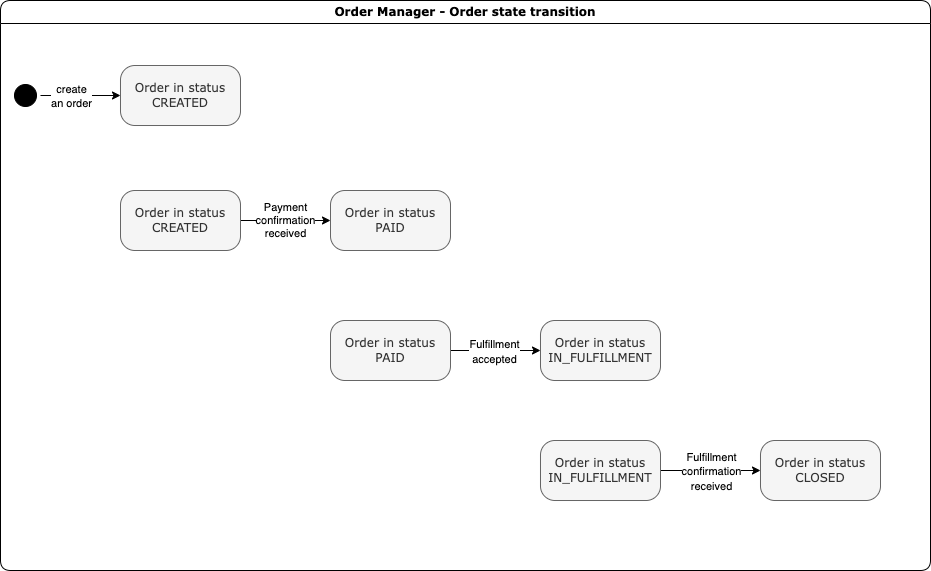
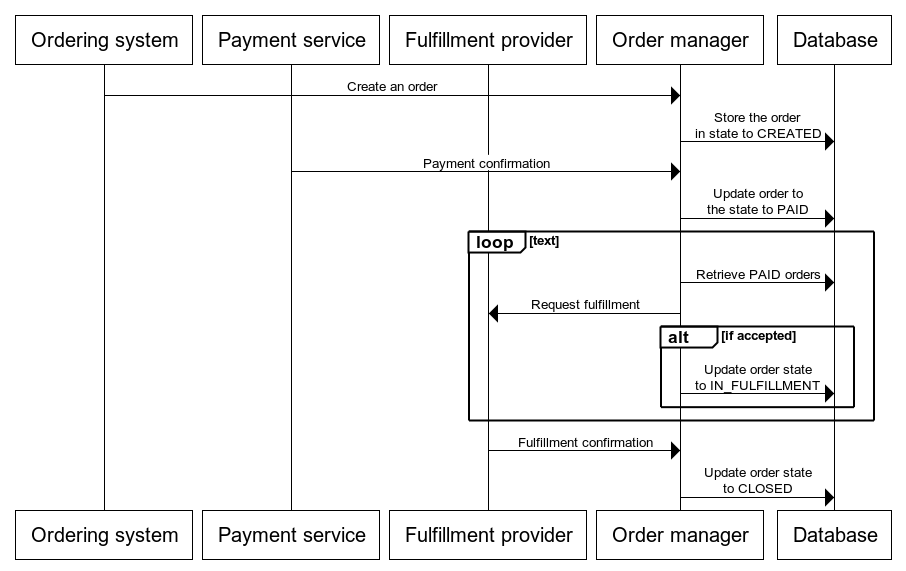

# Order manager

## How to run the application locally

### Prerequisites
* Docker
* JDK 11+
* Gradle

The application uses Postgres DB, therefore I should be deployed before usage of the application locally.

To start the postgres instance locally run
```bash
docker run --name some-postgres -e POSTGRES_PASSWORD=<password> -d postgres
```

Then execute `sh run.sh` to start the application.

When you see in logs like
```bash
[main] INFO  i.c.ProductionConfiguration - Initialization is finished
[main] INFO  Application - Application started in 0.533 seconds.
[DefaultDispatcher-worker-1] INFO  Application - Responding at http://0.0.0.0:8080
```
It means that application is up and running. 

## How the application works

### State transition



### Flow diagram



1. An order is created over the REST endpoint `PUT /order`, and it is stored in state `CREATED`
2. A payment confirmation endpoint `PUT /payment-confirmation` is used to transit from state `CREATE` to state `PAID`
3. After an order is `PAID`, the system submits a fulfillment request to external service. In case of successful submission, an order transit to state `IN_FULFILLMENT`
4. The system can be notified about successful fulfillment using fulfillment confirmation endpoint `PUT /fulfillment-confirmation`. In that case, an order transit to state `CLOSED`

## What was the implementation

The order management system is implemented using

1. [Kotlin](https://kotlinlang.org/) - as main programming language
2. [Gradle](https://gradle.org/) - as the build tool
3. [Ktor](https://ktor.io/) - as HTTP routing framework
4. [Arrow-kt](https://arrow-kt.io/) - for error handling following functional programming approach
5. [Postgres DB](https://www.postgresql.org/) - to store the state of the system
6. [Ktlint](https://ktlint.github.io/) - to maintain the common code style
7. [Jacoco](https://www.eclemma.org/jacoco/) - as coverage engine

## What was not implemented and what can be improved

* Credential management to restrict access to endpoints and the database
* Safety mechanisms against attacks like SQL injection prevention
* More real order fields to be closer to reality (e.g. customer details)
* More complex order validation
* Database related changes like
  * Separate database schema for the application
  * Usage of an ORM framework for more convenient work with the database
  * Good database structure, like indices, foreign keys or normalization
* Deployment configuration to cloud (e.g. k8s)
* Resilience instruments for dependencies like circuit breaker, etc
* Testing
  * Performance testing
  * Mutational testing
  * System testing
* Proper management of the object lifecycle
* Monitoring, for example prometheus metrics, open tracing, etc
* Use [Kover](https://github.com/Kotlin/kotlinx-kover) instead of jacoco to support kotlin coverage better
